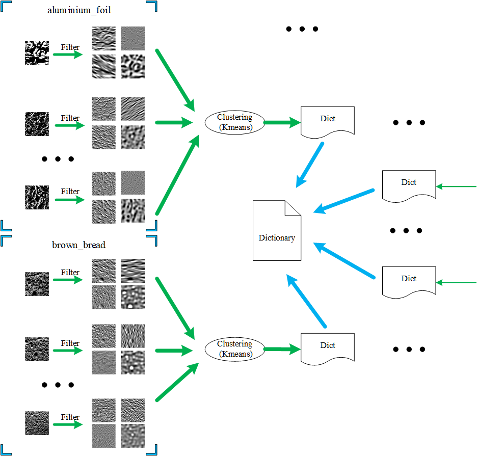
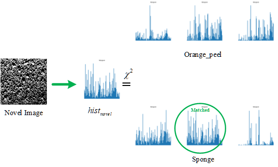
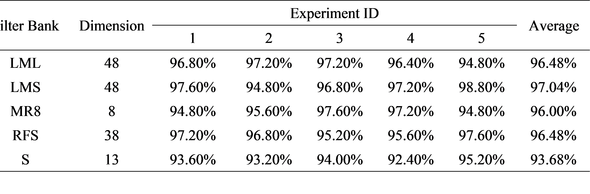

# Texture Classification Based on Filter Bank

This project is an implementation for Texture Classification based on different filter banks, coded in Python language.

Here we use 5 different filter banks to get image's filter response, which are S, LMS, LML, RFS and MR8.

## Project Structure

+ Runnable Python source file is [TextureClassification.py](./TextureClassification.py), which includes dictionary training, texture model construction and novel image prediction.
JUST CLONE THE REPOSITORY AND RUN IT!
+ Texture image dataset is in [KTH_TIPS_GRAY](./KTH_TIPS_GRAY) directory, which contains 10 texture classes for dictionary learning, model training and testing.
+ Scripts for generating filter banks are not implemented in Python, you can get MATLAB code for filter banks in [external_matlab_scripts](./external_matlab_scripts). These MATLAB scripts are from [Here](http://www.robots.ox.ac.uk/~vgg/research/texclass/filters.html).
+ Here we just load the output(mat data file) of MATLAB scripts and convolve it with image to get each image's filter response, the mat file is in [filter_banks](./filter_banks) directory.
+ [Dataset](./dataset) and [dictionary](./dictionary) directories are outputs of the runnable Python script, [dataset](./dataset) is the histogram set of training images while [dictionary](./dictionary) is learned from the dataset using Kmeans algorithm.
+ P.S. Clear the two directory ([Dataset](./dataset) and [dictionary](./dictionary)) to rebuild texton dictionary and retrain the classifier.

## Sketch Map of Texton Dictionary

## Sketch Map of Histogram Matching

## Process of Texture Classification
+ Texton Dictionary Learning
+ KNN Classifier Training
+ Novel Image Classifying

## Results

## Dependency

* [openCV 3.4.1](https://opencv.org/opencv-3-4-1/)

## References
* [1] Leung, T., Malik, J. Representing and Recognizing the Visual Appearance of Materials using Three-dimensional Textons. International Journal of Computer Vision 43, 29¨C44 (2001). https://doi.org/10.1023/A:1011126920638
* [2] Varma, M., Zisserman, A. A Statistical Approach to Texture Classification from Single Images. Int J Comput Vision 62, 61¨C81 (2005). https://doi.org/10.1007/s11263-005-4635-4
* [3] M. Varma and A. Zisserman, "Texture classification: are filter banks necessary?," 2003 IEEE Computer Society Conference on Computer Vision and Pattern Recognition, 2003. Proceedings., Madison, WI, USA, 2003, pp. II-691, doi: 10.1109/CVPR.2003.1211534.
* [4] M. Fritz, E. Hayman, B. Caputo, and J.-O. Eklundh. The KTH-TIPS database. Available at www.nada.kth.se/cvap/databases/kth-tips.

## Author Info
LeoHao (XMU-CS)

## Date
2020.11.12

